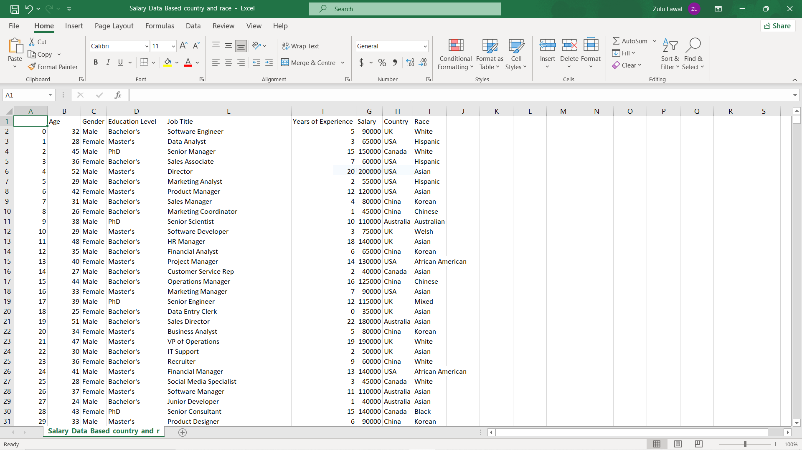
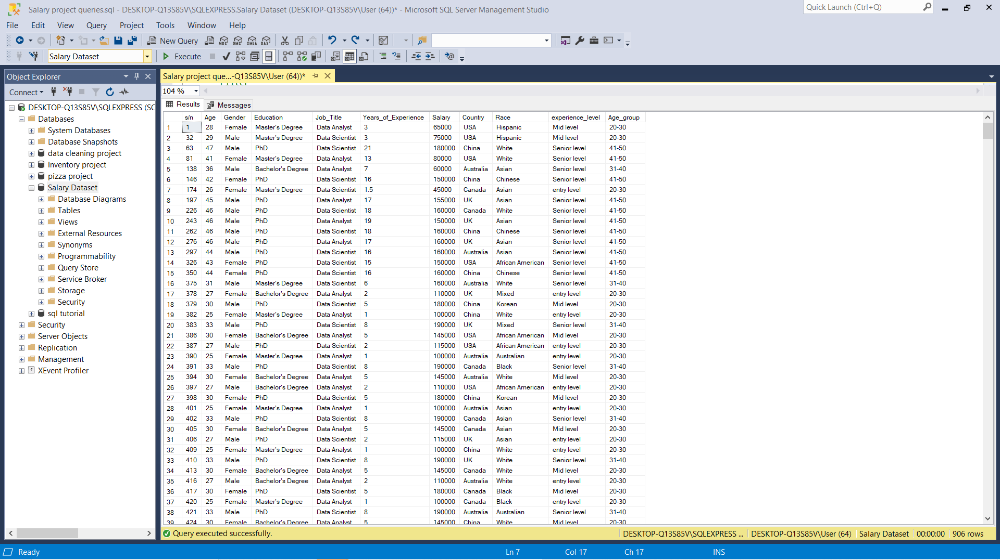
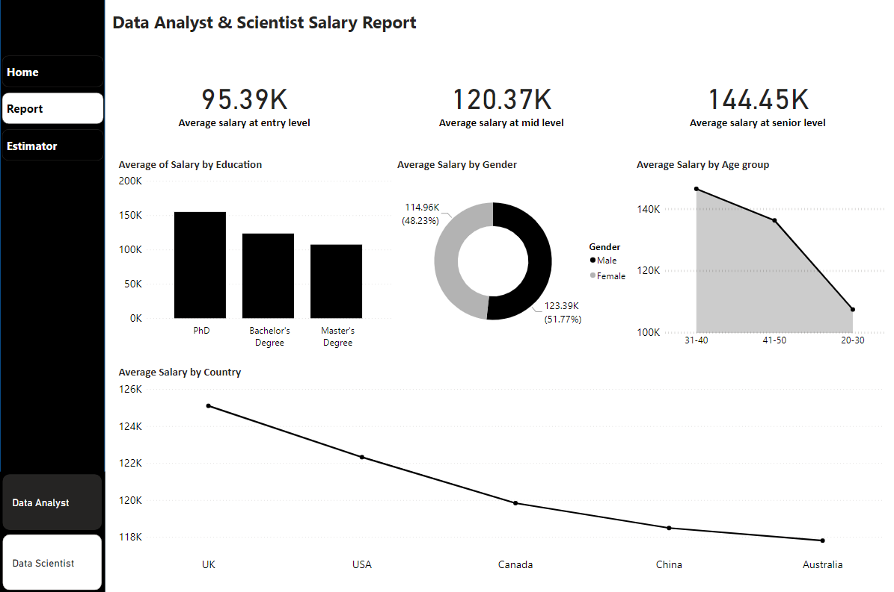
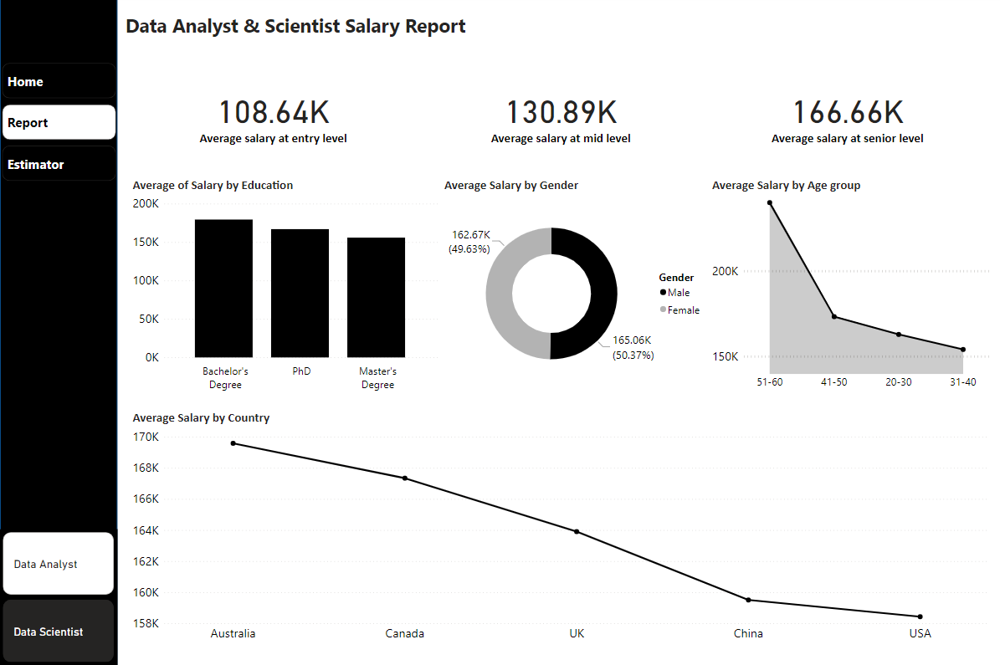
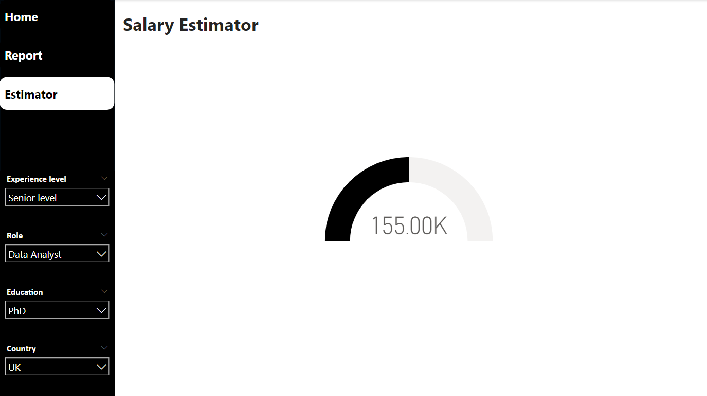

# Data Analyst & Scientist Salary Analysis and Estimator


# INTRODUCTION
This is a data analysis project looking to provide insight on the salary of data analyst and scientists in the US, UK, Canada, China, Australia and to also get a glimpse into what it can be like to know the expected average salary for a Data analyst or scientist role based on experience level, education and even country.  
_Note: This a dummy data set for me to use to showcase my skills and capabilities._
# TOOLS USED
- SQL – Data cleaning and Analysis,
- Power BI – Creation of Report and Visualization 

# SKILLS DEMONSTRATED
- Use of CASE STATEMENTS and CTE’s in SQL,
- The following power bi features were implemented as well; buttons, page navigation, quick measures, filters.

# DATA SOURCING
I came across this custom or hypothetical dataset of salaries of different professionals including data analyst and scientists on Kaggle which I found really interesting and when I got an idea of what I could create with the data set I downloaded the CSV file. 
## The data contains just one sheet with 9 columns and 6703 rows.

Here's a link to the Dataste on Kaggle:(https://www.kaggle.com/datasets/veronikanikaaa/salary-data-based-on-country-and-race)

# DATA CLEANING AND TRANSFORMATION
 The data was efficiently cleaned and made more usable using Microsoft SQL Server. Some of the transformation and cleaning ai effected are as follow;
1. Filtering out my data for only data scientists and analyst roles
  ```sql
--This SQL code performs the following actions: Creates a temporary result set named "filter" containing rows from the "salary" table where the "Job_Title" column contains "Data Scientist" or "Data Analyst".
select * from Salary
where Job_Title like '%Data Scientist' or Job_Title like '%Data Analyst'
```
2. Created a category for experience level based on years of experience
   ```sql
   with filter as (select * from salary WHERE Job_Title like '%Data Scientist' or Job_Title like '%Data Analyst')
   select job_title,years_of_experience,
   case when years_of_experience <= 2 then 'Entry level'
     when years_of_experience <= 5 then 'Mid level'
   else 'Senior level'
   end as experience_level
   from filter;

   alter table salary
   add experience_level nvarchar(50);

   update salary
   set experience_level = case when years_of_experience <= 2 then 'entry level'
     when years_of_experience <= 5 then 'Mid level'
   else 'Senior level';
```   
3. Corrected spellings in the education column
   ``` sql
   with filter as (select * from salary WHERE Job_Title like '%Data Scientist' or Job_Title like '%Data Analyst')
   select education,
   case when education like '%Bachelor%' then 'Bachelor''s Degree'
     when education like '%Master%' then 'Master''s Degree'
   else education
   end
   from filter ;

   update Salary
   set Education= case when education like '%Bachelor%' then 'Bachelor''s Degree'
     when education like '%Master%' then 'Master''s Degree'
   else education
   end ;
```
4. Created a new column “Age group” for analytical and visualization purposes
   ```sql
   select age,
   case
    when age>=20 and age<=30 then '20-30'
	when age>=31 and age<=40 then '31-40'
	when age>=41 and age<=50 then '41-50'
	when age>=51 and age<=60 then '51-60'
	else '60+'
	end AS Age_group
   from Salary;

   alter table salary
   add Age_group nvarchar (15);

   update Salary
   set Age_group =Case 
   when age>=20 and age<=30 then '20-30'
	when age>=31 and age<=40 then '31-40'
	when age>=41 and age<=50 then '41-50'
	when age>=51 and age<=60 then '51-60'
	else '60+'
	end;
  ```
5. Simplified Job title column to just Data analyst and Data scientists for analytical and visualization purposes
```sql
with filter as (select * from salary WHERE Job_Title like '%Data Scientist' or Job_Title like '%Data Analyst')
select Job_title,
case when Job_Title = 'Junior Data Analyst' then 'Data Analyst'
     when Job_Title = 'Junior Data Scientist' then 'Data Scientist'
	 when Job_Title = 'Senior Data Analyst' then 'Data Analyst'
	 when Job_Title = 'Senior Data Scientist' then 'Data Scientist'
	 else job_title
end 
from filter ;

update Salary
set Job_Title = case when Job_Title = 'Junior Data Analyst' then 'Data Analyst'
     when Job_Title = 'Junior Data Scientist' then 'Data Scientist'
	 when Job_Title = 'Senior Data Analyst' then 'Data Analyst'
	 when Job_Title = 'Senior Data Scientist' then 'Data Scientist'
	 else job_title
end ;
```
This is what the data looked liked after cleaning and transformation:


# EXPLORATORY DATA ANALYSIS
EDA involved exploring the Salary Data questions such as

What is the average salary for entry, mid, and senior roles?
```sql
--This code can be retrofited to analyze for Data scientist roles by switching Data Analyst with Data Scientist in the Having clause.
with filter as (select * from salary WHERE Job_Title like '%Data Scientist' or Job_Title like '%Data Analyst')
select job_title,experience_level,round(AVG(salary),0) from filter
group by job_title,experience_level
having job_title = 'Data Analyst' and experience_level = 'Entry level' ;
---mid level
with filter as (select * from salary WHERE Job_Title like '%Data Scientist' or Job_Title like '%Data Analyst')
select job_title,experience_level,round(AVG(salary),0) from filter
group by job_title,experience_level
having job_title = 'Data Analyst' and experience_level = 'mid level' ;
---Senior level
with filter as (select * from salary WHERE Job_Title like '%Data Scientist' or Job_Title like '%Data Analyst')
select job_title,experience_level,round(AVG(salary),0) from filter
group by job_title,experience_level
having job_title = 'Data Analyst' and experience_level = 'Senior level' ;
```
What is the average salary based on gender for each role?
```sql
--This code can be retrofited to analyze for Data scientist roles by switching Data Analyst with Data Scientist in the Having clause.
with filter as (select * from salary WHERE Job_Title like '%Data Scientist' or Job_Title like '%Data Analyst')
select Gender,round(AVG(salary),0)
from filter
group by Gender,Job_Title
having Job_Title = 'Data Analyst' ;
```
What is the average salary based on education for each role?
```sql
--This code can be retrofited to analyze for Data scientist roles by switching Data Analyst with Data Scientist in the Having clause.
with filter as (select * from salary WHERE Job_Title like '%Data Scientist' or Job_Title like '%Data Analyst')
select education,round(avg(salary),0) as average_salary
from filter
group by Job_Title,Education 
having Job_Title = 'Data Analyst' ;
```
What is the average salary in each country based on the roles?
``` sql
--This code can be retrofited to analyze for Data scientist roles by switching Data Analyst with Data Scientist in the Having clause.
with filter as (select * from salary WHERE Job_Title like '%Data Scientist' or Job_Title like '%Data Analyst')
select Country,round(AVG(salary),0)
from filter
group by Country, Job_Title
having Job_Title = 'Data Analyst' ;
```

# FINDINGS
- There’s not much disparity in the salary gender wise.
- Entry level roles tend to have lesser average salary compared to mid and senior roles.
- Data analyst in the Uk earn more compared to Data analysts in the other countries.
- Data Scientist in Australia earn more compared to Data Scientists in the other countries.

# VISUALIZATION
The projects report is made up of 3 pages;
1.	Home page: From this page you can navigate to the other 2 pages by clicking their buttons.
2.	Report page: This page shows the visualization of our analysis. This page gives the option of selecting either the report for Data analyst or scientist role and also a menu to navigate to the other 2 pages.
   
   Data Analyst page                            |      Data Scientist page
:----------------------------------------------:|:-------------------------------------------------:                                                                
                      |   

### Features.
- The home, report and estimator buttons are to navigate pages
- The data analyst and scientist buttons are to filter the report based on this roles
3.	Estimator page: This is a page I created for fun to give the functionality of getting your expected average salary based on a couple of criteria such as role, experience level, education and country.


### Features.
- Single gauge chart showing the estimate salary for visual effect.
- Filter Menu to select criteria based on personal details

  You can interact with the report here (https://app.powerbi.com/view?r=eyJrIjoiMGQxODBlZGMtMGE2Yy00YWJmLWI3MjYtMzQyOWUxMGU2NTc0IiwidCI6ImRmODY3OWNkLWE4MGUtNDVkOC05OWFjLWM4M2VkN2ZmOTVhMCJ9)


